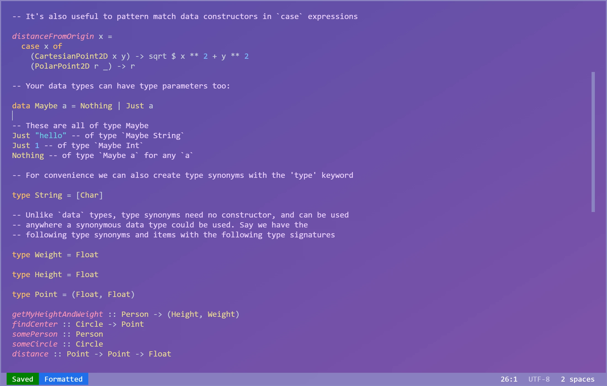

# Haskedit

The simple Haskell editor for Windows built with Javascript



## Contents

- [About Haskedit](#about-haskedit)
    - [Haskedits Terminal 'Emulator'](#haskedits-terminal-emulator)
- [Use Haskedit](#use-haskedit)
    - [Managing the Haskedit Window](#managing-the-haskedit-window)
    - [Haskedit Command Shortcuts](#haskedit-command-shortcuts)
    - [Customize Haskedit Shortcuts](#customize-haskedit-shortcuts)
    - [Haskedit Overridden Commands](#haskedit-overridden-commands)
    - [Haskedit Terminal Commands](#haskedit-terminal-commands)
- [Use on non-Windows platforms](#use-on-non-windows-platforms)
- [Should You Use Haskedit](#should-you-use-haskedit)
- [Long Term Support?](#long-term-support)
- [Future Additions](#future-additions)

## About Haskedit

Haskedit is a very simple Haskell editor for Windows that I built (mostly) in a day using Javascript and the nw.js runtime. I built it because I was 
required to learn and use Haskell for a few months and having tried most of the freely available existing editors decided that there was nothing I
was truly happy with. Haskedit supports syntax highlighting, automatic code formatting and some quality of life shortcuts.

Haskedit is by no means the best Haskell editor, but it has served me well and overall I've been quite pleased with it.

### Haskedits Terminal 'Emulator'

The haskedit terminal 'emulator' isn't actually a terminal emulator, instead it launches an instance of `cmd.exe` for each native (to windows) command and then listens to
the output. It does not support running cli applications like ghci, however for ghci in particular, haskedit will spawn a new `cmd.exe` window.

## Use Haskedit

Haskedit is largely reliant on keybindings for manipulating the window and editor. The default bindings are described below, however custom bindings can be created within
the `haskedit_modules/bindings.js` file (described further below).

The experience of Haskedit can be greatly improved by setting Haskedit as the default application for all `.hs` files.

### Managing the Haskedit Window

| Action                                                | Binding                                 |
|-------------------------------------------------------|-----------------------------------------|
| Quit Haskedit (Unless file unsaved)                   | <kbd>Ctrl</kbd> + <kbd>Q</kbd>          |
| Maximize Haskedit                                     | <kbd>Ctrl</kbd> + <kbd>Arrow Up</kbd>   |
| Restore Haskedit if maximized, else Minimize Haskedit | <kbd>Ctrl</kbd> + <kbd>Arrow Down</kbd> |
| Toggle Command Prompt                                 | <kbd>Ctrl</kbd> + <kbd>Space</kbd>      |

### Haskedit Command Shortcuts

| Action                                                         | Binding                        |
|----------------------------------------------------------------|--------------------------------|
| Save currently open file                                       | <kbd>Ctrl</kbd> + <kbd>S</kbd> |
| Launches ghci in a new `cmd.exe` window (for the current file) | <kbd>Ctrl</kbd> + <kbd>I</kbd> |

### Customize Haskedit Shortcuts

Haskedit shortcuts are defined as boolean functions and can be found in the `haskedit_modules/bindings.js` file. To customize them use the `KeyboardEvent`
object passed into each function.

```js
/**
 * The default key binding for the window quit functionality. Quits on ctrl + q
 * 
 * @param {KeyboardEvent} e The keyboard event object from the keydown event.
 * @returns {boolean} If the binding is currently pressed
 */
function quit(e) {
    return e.ctrlKey && e.key === 'q';
}
```

### Haskedit Overridden Commands

Due to the nature of Haskedits terminal 'emulator' as mentioned above, some system commands are overridden. Their functionality should remain the same,
however it is best to be aware that they may not perform exactly as you would expect.

| Command | Function                                                    |
|---------|-------------------------------------------------------------|
| `cd`    | Changes the current working directory (managed by Haskedit) |
| `cls`   | Clears the console (permanent).                             |

### Haskedit Terminal Commands

| Command                           | Function                                          |
|-----------------------------------|---------------------------------------------------|
| `set-indentation-level` \[`num`\] | sets the editor indentation level.                |                                  
| `save` \[`string`\] \[`--force`\] | saves the specified or currently open file.       |
| `open` \[`string`\]               | opens the specified file in the editor.           |                                  
| `quit` \[`--force`\]              | quits the application.                            |                                  
| `ghci` \[`arg string`\]           | opens a new cmd.exe to launch a ghci environment. |          

## Use on non-Windows platforms

Currently, Haskedit only supports Windows due to hard coded file paths and executables. I suspect this will remain the case as I have no reason
to change this, however if you are desperate to use it on a non-Windows platform these issues shouldn't take to long to resolve.

## Should You Use Haskedit?

The answer to this is very simple: **you probably shouldn't**. I built Haskedit because I didn't like or couldn't configure any of the existing
editors that support Haskell in the way that I wanted, however this doesn't make Haskedit good. It has been very useful and lightweight for me,
however it is lacking very key features like syntax checking (though this can mostly be done through ghci) and tab completion.

## Long Term Support?

As this project was largely built in one day, I do not intend to support it for longer than I need to use Haskell.

## Future Additions

The final additions that I aim to add at some point in the near future.

- [ ] Run command (ghc) + keybinding
- [ ] Build command (ghc) + keybinding